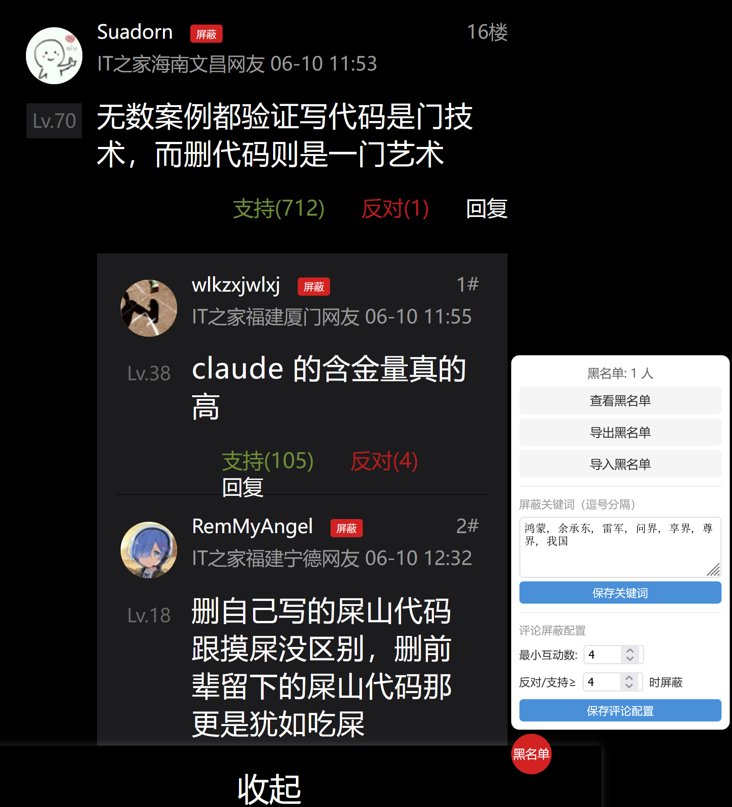

  

  

<h1 align="center">IT之家 内容优化脚本</h1>

<strong>一键屏蔽关键词新闻、轮播图、红包弹窗、低质评论及烦人用户，还你清爽阅读体验。</strong>

<h2>✨ 功能特性</h2>
<ul>
<li>🔇 <strong>关键词屏蔽</strong>：自动隐藏标题中包含指定关键词的新闻条目。</li>
<li>🎠 <strong>轮播图优化</strong>：移除轮播图中匹配关键词的幻灯片，且不影响剩余幻灯片的自动播放。</li>
<li>📵 <strong>底部横幅自动关闭</strong>：自动点击并关闭"打开APP"底部横幅。</li>
<li>👻 <strong>隐藏"打开APP"图标</strong>：移除右下角悬浮的"打开APP"按钮。</li>
<li>🧧 <strong>红包弹窗移除</strong>：自动删除618/双11等促销红包iframe，彻底告别弹窗。</li>
<li>👎 <strong>低质评论屏蔽</strong>：根据支持/反对比例自动隐藏高反对低支持的低质评论，阈值可配置。</li>
<li>🚫 <strong>用户黑名单</strong>：评论用户名旁显示"屏蔽"按钮，一键拉黑，该用户所有评论自动隐藏。</li>
<li>📥📤 <strong>黑名单导入/导出</strong>：支持导出为 JSON 文件备份，导入时自动合并去重。</li>
<li>⚙️ <strong>可视化配置面板</strong>：右下角管理按钮，可直接在页面内修改屏蔽关键词、评论屏蔽阈值，无需编辑代码。</li>
<li>🌐 <strong>全站覆盖</strong>：支持首页、热榜、分类等所有移动端子页面 (<code>m.ithome.com/*</code>)。</li>
</ul>

<h2>📸 效果预览</h2>
<table>
<tr>
<th>屏蔽前</th>
<th>屏蔽后</th>
</tr>
<tr>
<td></td>
<td></td>
</tr>
<table>
<tr>
<th>面板 & 屏蔽按钮</th>
</tr>
<tr>
<td></td>
</tr>
</table>
</table>

<h2>🚀 安装方法</h2>
<ol>
<li>安装用户脚本管理器扩展：
<ul>
<li><a href="https://www.tampermonkey.net/" target="_blank">Tampermonkey</a>（推荐）</li>
<li><a href="https://violentmonkey.github.io/" target="_blank">Violentmonkey</a></li>
<li><a href="https://scriptcat.org/" 
target="_blank">Script Cat</a></li>
</ul>
</li>
<li>点击下方手动复制脚本代码：
<ul>
<li><strong>手动安装</strong>：复制本仓库中的 <code>Block_ITHome_Title_Keyword.user.js</code> 文件内容，在脚本管理器中新建脚本并粘贴保存。</li>
</ul>
</li>
<li>刷新 IT之家 页面，立即生效。</li>
</ol>

<h2>🔧 自定义配置</h2>

脚本所有配置均可在页面内通过右下角的<strong>「黑名单」管理按钮</strong>进行修改，修改后自动保存到浏览器本地，无需编辑代码。

<h3>屏蔽关键词</h3>

在配置面板的文本框中输入关键词（中英文逗号均可分隔），点击"保存关键词"即可生效。

<h3>评论屏蔽配置</h3>
<ul>
<li><strong>最小互动数</strong>：支持+反对总数达到此值才进行比例判断（默认 4）</li>
<li><strong>反对/支持比例阈值</strong>：反对数 ÷ 支持数 ≥ 此值时屏蔽该评论（默认 4）</li>
</ul>

<h3>用户黑名单</h3>
<ul>
<li>评论区的用户名旁会显示红色的<strong>「屏蔽」</strong>按钮，点击即可将用户加入黑名单</li>
<li>已屏蔽用户按钮显示为灰色<strong>「已屏蔽」</strong>，再次点击可移除</li>
<li>黑名单支持<strong>导出</strong>为 JSON 文件和<strong>导入</strong>（自动合并去重）</li>
<li>可在面板中<strong>查看黑名单</strong>并批量移除用户</li>
</ul>

<h3>手动编辑配置（可选）</h3>

如需直接编辑代码中的默认值，可修改脚本开头的 <code>DEFAULT_KEYWORDS</code> 数组：

<pre><code class="language-javascript">const DEFAULT_KEYWORDS = [];
</code></pre>

首次加载时使用默认值，修改后通过面板保存的配置会覆盖默认值。

<h2>📜 许可证</h2>

MIT License © Hubupup

---

  

  

