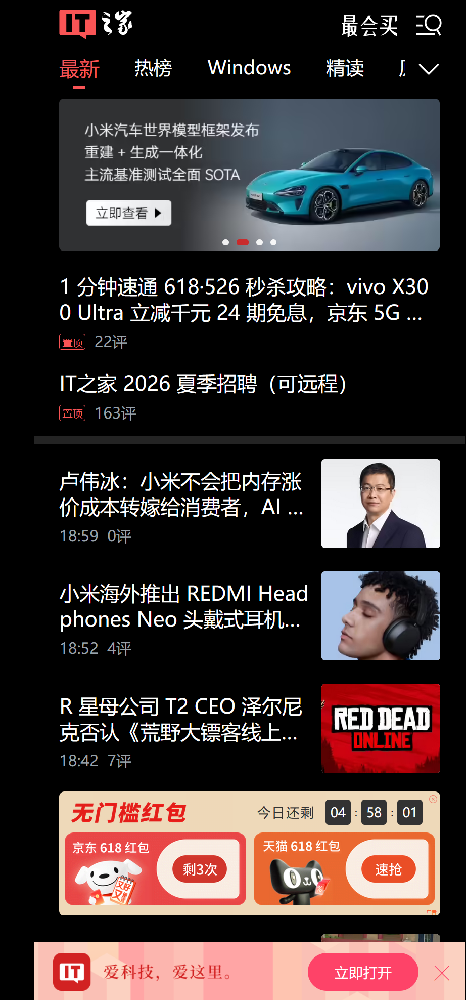
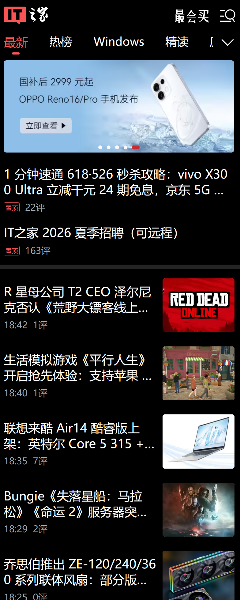

<input type="radio" id="cn-tab" name="lang" checked hidden>
<input type="radio" id="en-tab" name="lang" hidden>

  <label for="cn-tab" class="cn-label">🇨🇳 中文</label>
  <label for="en-tab" class="en-label">English</label>

<!-- ================= 中文内容 ================= -->

<h1 align="center">IT之家 内容优化脚本</h1>

  <strong>一键屏蔽关键词新闻、轮播图、红包弹窗及推广元素，还你清爽阅读体验。</strong>

<h2>✨ 功能特性</h2>
<ul>
  <li>🔇 <strong>关键词屏蔽</strong>：自动隐藏标题中包含指定关键词的新闻条目。</li>
  <li>🎠 <strong>轮播图优化</strong>：移除轮播图中匹配关键词的幻灯片，且不影响剩余幻灯片的自动播放。</li>
  <li>📵 <strong>底部横幅自动关闭</strong>：自动点击并关闭“打开APP”底部横幅。</li>
  <li>👻 <strong>隐藏“打开APP”图标</strong>：移除右下角悬浮的“打开APP”按钮。</li>
  <li>🧧 <strong>红包弹窗移除</strong>：自动删除618/双11等促销红包iframe，彻底告别弹窗。</li>
  <li>🌐 <strong>全站覆盖</strong>：支持首页、热榜、分类等所有移动端子页面 (<code>m.ithome.com/*</code>)。</li>
</ul>

<h2>📸 效果预览</h2>
<table>
  <tr>
    <th>屏蔽前</th>
    <th>屏蔽后</th>
  </tr>
  <tr>
    <td></td>
    <td></td>
  </tr>
</table>

<h2>🚀 安装方法</h2>
<ol>
  <li>安装用户脚本管理器扩展：
    <ul>
      <li><a href="https://www.tampermonkey.net/" target="_blank">Tampermonkey</a>（推荐）</li>
      <li><a href="https://violentmonkey.github.io/" target="_blank">Violentmonkey</a></li>
    </ul>
  </li>
  <li>点击下方手动复制脚本代码：
    <ul>
      <li><strong>手动安装</strong>：复制本仓库中的 <code>Block_ITHome_Title_Keyword.user.js</code> 文件内容，在脚本管理器中新建脚本并粘贴保存。</li>
    </ul>
  </li>
  <li>刷新 IT之家 页面，立即生效。</li>
</ol>

<h2>🔧 自定义关键词</h2>

在脚本开头的 <code>BLOCK_KEYWORDS</code> 数组中修改或添加你想屏蔽的关键词：

<pre><code class="language-javascript">const BLOCK_KEYWORDS = [
    '鸿蒙',
    '余承东',
    '雷军',
    '问界',
    '我国',
    // 添加更多关键词...
];
</code></pre>

保存后刷新页面即可生效。

<h2>📜 许可证</h2>

MIT License © Hubupup

<!-- ================= 英文内容 ================= -->

<h1 align="center">ITHome Content Blocker</h1>

  <strong>One-click block unwanted news, banner ads, red packet popups, and promotions on m.ithome.com for a clean reading experience.</strong>

<h2>✨ Features</h2>
<ul>
  <li>🔇 <strong>Keyword Blocking</strong>: Auto-hides news items whose titles contain specified keywords.</li>
  <li>🎠 <strong>Carousel Optimization</strong>: Removes matched slides from the top banner without breaking autoplay of the remaining ones.</li>
  <li>📵 <strong>Auto Close Bottom Banner</strong>: Simulates a click on the “Open App” bottom banner to close it automatically.</li>
  <li>👻 <strong>Hide “Open App” Icon</strong>: Permanently hides the floating “Open in App” button at the bottom-right corner.</li>
  <li>🧧 <strong>Remove Red Packet Popup</strong>: Detects and deletes the iframe used for 618/Double 11 promotional popups.</li>
  <li>🌐 <strong>Site-wide Coverage</strong>: Works on all subpages of <code>m.ithome.com</code> (homepage, hot list, category pages, etc.).</li>
</ul>

<h2>📸 Screenshots</h2>
<table>
  <tr>
    <th>Before</th>
    <th>After</th>
  </tr>
  <tr>
    <td></td>
    <td></td>
  </tr>
</table>

<h2>🚀 Installation</h2>
<ol>
  <li>Install a userscript manager extension:
    <ul>
      <li><a href="https://www.tampermonkey.net/" target="_blank">Tampermonkey</a> (recommended)</li>
      <li><a href="https://violentmonkey.github.io/" target="_blank">Violentmonkey</a></li>
    </ul>
  </li>
  <li>Install the script:
    <ul>
      <li><strong>Manual install</strong>: Copy the content of <code>Block_ITHome_Title_Keyword.user.js</code> from this repository, create a new script in your manager and paste it.</li>
    </ul>
  </li>
  <li>Refresh m.ithome.com and enjoy.</li>
</ol>

<h2>🔧 Customize Keywords</h2>

Modify the <code>BLOCK_KEYWORDS</code> array at the top of the script to add your own blocked words:

<pre><code class="language-javascript">const BLOCK_KEYWORDS = [
    '鸿蒙',
    '余承东',
    '雷军',
    '问界',
    '我国',
    // Add more keywords...
];
</code></pre>

Save and refresh the page to apply changes.

<h2>📜 License</h2>

MIT License © Hubupup

